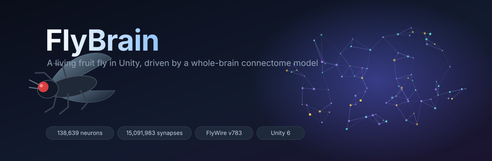

<div align="center">



# FlyBrain

**Живая дрозофила в Unity, рефлексами которой управляет полная модель мозга *Drosophila melanogaster*.**

[](https://unity.com/releases/editor/archive)
[](Assets/FlyBrain/Scripts)
[](https://flywire.ai/)
[](#что-решает-мозг-а-что--тело)
[](#что-решает-мозг-а-что--тело)
[](#порт-модели-и-его-проверка)

[**English version →**](README.md)

</div>

---

## Что это

В саду живёт одна муха. Её поведение никто не прописывал: каждый рефлекс, помеченный в интерфейсе как **МОЗГ**,
декодирован из спайков модели leaky integrate-and-fire *всего* мозга мухи — 138 639 нейронов и 15 091 983 связей
коннектома FlyWire v783, портированной на C# из
[philshiu/Drosophila_brain_model](https://github.com/philshiu/Drosophila_brain_model)
(Shiu et al., «A Drosophila computational brain model reveals sensorimotor processing», **Nature** 2024).

Муха свободна: она живёт в своей естественной среде — на земле сада под яблоней, среди опавших бродящих
фруктов — сама решает, что делать, хочет есть, пить и спать, ищет еду по запаху, летает, садится на любые
поверхности, чистится, откладывает яйца, спасается от паука и птицы. Все движения тела (ноги, хоботок,
антенны, голова, крылья, жужжальца, брюшко) решаются через IK.

> **Если одной фразой:** коснитесь лапкой мухи капли сахара — и спайк, дошедший до мотонейрона MN9, будет тем же,
> который предсказывает настоящий коннектом: хоботок вытягивается потому, что так решила модель, а не `if`.

<!--
  📸 Место для скриншотов. Положите PNG/GIF в docs/ и раскомментируйте:

  <div align="center">
    
    
  </div>
-->

### Содержание

- [Как запустить](#как-запустить)
- [Управление](#управление)
- [Естественная среда](#естественная-среда)
- [Что решает мозг, а что — тело](#что-решает-мозг-а-что--тело)
- [Как устроено](#как-устроено)
- [Порт модели и его проверка](#порт-модели-и-его-проверка)
- [Ограничения](#ограничения)
- [Автотест](#автотест)
- [Перегенерация данных](#перегенерация-данных)
- [Благодарности и источники](#благодарности-и-источники)

---

## Как запустить

**Требуется:** Unity **6000.4**. Бинарники коннектома уже лежат в репозитории
(`Assets/StreamingAssets/FlyBrain/`), так что для запуска ничего скачивать и генерировать не нужно.

1. Откройте проект в Unity 6000.4. При первом импорте скрипт `FlyBrainSetup` сам создаст сцену
   `Assets/Scenes/FlyBrainDemo.unity` и откроет её (или меню **FlyBrain → Открыть демо-сцену**).
2. Нажмите **Play**. Мир строится процедурно за пару секунд, мозг загружается ~1–3 с.
3. Собрать отдельную программу: **FlyBrain → Собрать Windows-версию**.
4. Классическая лаборатория (чашка Петри) — кнопка «Среда» в интерфейсе или ключ запуска `-flybrainLab`.

**Скорость** (i5-12400F): 5–15× реального времени в обычной жизни мухи, 2–4× при сильной стимуляции
(полёт, пыль, оптогенетика). Если мозг не успевает, мир автоматически замедляется, чтобы петля тело–мозг
оставалась честной.

## Управление

| Клавиша | Действие |
|---|---|
| ПКМ / колесо / СКМ | вращение, зум, сдвиг камеры; **F** — следовать за мухой; **C** — кинокамера |
| **W** | свобода вкл/выкл (без неё остаются только рефлексы мозга) |
| **[** / **]** / **K** | медленнее / быстрее сутки, пропустить час |
| 1 / 2 / 3 + ЛКМ | капля сахара / воды / горечи на любую поверхность |
| 4 + ЛКМ | поток воздуха в антенны |
| 5 + ЛКМ по голове | пыль на глаза |
| 6 + ЛКМ | надвигающийся объект |
| 7 + ЛКМ | маленький движущийся объект |
| 8 / 9 + ЛКМ | позвать паука-скакуна / пролёт дрозда |
| N / B / Tab | нейроны сенсоров и DN / облако всех нейронов / оптогенетика любых типов клеток FlyWire |
| M / Space / R / Del / H / F1 | звук / пауза / сброс мозга / убрать объекты / скрыть UI / справка |

## Естественная среда

Сцена в масштабе 1 единица = 1 мм, около 3 × 3 м сада с дальним фоном:

- **Опавшие фрукты**: гниющие и расклёванные яблоки, лопнувшая слива, гнилая груша, вишни, заплесневелое
  яблоко. На гнили и ранах — бродящий сок (сахар) с дрожжами, который понемногу снова выступает; плесень горькая.
- **Запах брожения** уносится ветром: у каждого источника есть диффузное облако и шлейф, который расширяется
  по ветру и рвётся на нити (перемежаемость), как в настоящем воздухе.
- **Вода**: лужа у камня и роса, которая выпадает на рассвете на листьях, камнях и фруктах и высыхает к полудню.
- **Земля, листья, камни, ветки, кора, трава**: по всему, кроме травинок, можно ходить — в том числе вверх ногами.
- **Сутки** (по умолчанию 24 мин): солнце, луна, звёзды, облака, туман на рассвете, пятна солнца под кроной,
  температура; ветер с порывами слабеет ночью и у самой земли (пограничный слой).
- **Соседи** (без модели мозга, простые правила): дикие мухи (самец ухаживает, поёт крылом), тропа муравьёв,
  паук-скакун *Salticus scenicus* (подкрадывается и прыгает), дрозд, иногда пролетающий над фруктами.
- **Звук** синтезируется: тон крыльев ~220 Гц, ветер, птицы (утренний хор), сверчки ночью.

## Что решает мозг, а что — тело

Интерфейс помечает каждое текущее решение: **МОЗГ** — оно декодировано из спайков модели,
**ВНЕ МОДЕЛИ** — его сделал слой мотивации и «виртуальная VNC».

### Мозг (коннектом FlyWire 783)

| Ситуация в мире | Сенсорные нейроны (Poisson) | Ответ модели | Поведение |
|---|---|---|---|
| лапки/хоботок в соке | сахарные GRN (списки из статьи) | MN9 (CB0701), мотонейроны глотания | хоботок к соку, глотание, зоб наполняется |
| порыв ветра, воздух | JO-C/E, JO-F | aDN1 (DNg62), aDN2 (DNge078) | груминг антенн |
| пыль, пыльца, споры на глазах | щетинки глаз | aDN1/aDN2 | чистка глаз; ноги счищают пылинки |
| прыжок паука, пикирующая птица | LC4 + LPLC2 | Giant Fiber (DNp01), DNp02/04/06/11 | взлёт-бегство, замирание |
| поверхность надвигается при посадке | LPLC2 (расширение в полёте) | DNp103, DNg40, DNp70 | ноги выпускаются к посадке* |
| мухи и муравьи рядом | LC10a | DNa02/DNa04 со стороны объекта | поворот к движущемуся объекту |
| надвигание в полёте | LC4/LPLC2 одной стороны | контралатеральные DNa01/DNa02/DNa04, DNb01 | вираж в полёте |
| лобовое надвигание / оптогенетика LC16 | LC16 | MDN | ходьба назад |

\* DNp07/DNp10, известные по литературе как «посадочные», в этой модели на LPLC2/LC4 почти не отвечают, поэтому
посадка декодируется из нисходящих нейронов, которые LPLC2 реально возбуждает; это гипотеза, а не факт из статьи.

### Тело и мотивация (в коннектоме этого нет)

- **Физиология** на сжатых биологических часах: энергия, зоб, вода, давление сна, страх, созревание яиц.
  Голод и сытость действуют на мозг как нейромодуляция — меняют чувствительность сахарных GRN
  (у голодной мухи порог MN9 достигается от касания лапкой, у сытой — нет), поэтому **еда заканчивается
  в модели мозга сама**. Сон повышает порог пробуждения (снижает вход от глаз и антенн).
- **Выбор занятия**: исследование, отдых, поиск еды, поиск воды, питьё, локальный поиск у съеденной еды
  («танец» мухи), чистка передними/задними ногами, откладывание яиц на бродящий фрукт, отказ ухаживающему
  самцу, укрытие в сумерках, сон ночью и в сиесту, бегство. Активность пиковая на рассвете и в сумерках.
- **Навигация**: против ветра по шлейфу запаха, галсы поперёк ветра при потере запаха, градиент вблизи
  источника, градиент влажности к воде, память мест, где ела и пила, отрицательный геотаксис.
- **Движение**: ходьба по любой поверхности (нормаль, переход на стены, огибание рёбер, не лезет в щели),
  трёхногая походка, произвольный и спасательный взлёт, полёт со сносом ветром, облётом препятствий и
  выбором места посадки, касание любой поверхности.
- **Питьё** управляется телом: в этой модели водные GRN не возбуждают MN9.

## Как устроено

```
BrainModel/
  Drosophila_brain_model/    клон репозитория с моделью (Brian2) и данными коннектома
  flywire_annotations/       аннотации FlyWire (типы клеток, стороны, координаты)
  tools/export_brain.py      экспорт parquet/csv → бинарники для Unity
  BrainSim/                  .NET-стенд: проверка порта против Brian2, профилирование, пробы путей
Assets/StreamingAssets/FlyBrain/   connectome_783.bin, neurons_783.bin, groups_783.tsv
Assets/FlyBrain/Scripts/
  Brain/Core/         C#-порт LIF-модели (Burst в Unity, тот же код в BrainSim)
  Runtime/Brain/      BrainService: фоновый поток симуляции, синхронизация времени мира и мозга
  Runtime/Body/       процедурная муха, IKChain (FABRIK с полюсами), FlyMotor (поверхности, походка, груминг, полёт)
  Runtime/Interface/  FlySensors (мир → частоты сенсорных нейронов), FlyNervousSystem (DN/MN → команды)
  Runtime/Mind/       FlyPhysiology (голод, жажда, сон, страх, яйца), FlyMind (мотивация и навигация)
  Runtime/World/      NatureEnvironment (сад), LabEnvironment (чашка Петри), DayCycle, WindField, OdorField,
                      WorldObjects (капли, стимулы), Wildlife (мухи, муравьи, паук, дрозд), FlyEgg
  Runtime/UI/         интерфейс, камера, облако нейронов, синтез звука
  Runtime/Util/       процедурные меши и текстуры природы
```

## Порт модели и его проверка

Уравнения и параметры совпадают с `model.py`: `dv/dt = (v0 − v + g)/20 мс`, `dg/dt = −g/5 мс`,
порог −45 мВ, сброс −52 мВ, рефрактерность 2.2 мс, задержка 1.8 мс, вес 0.275 мВ на синапс,
Poisson-активация толчком 68.75 мВ, шаг 0.1 мс, точное интегрирование. Важная деталь Brian2:
флаг `(unless refractory)` делает запись в `v` и `g` условной, поэтому синаптические входы во время
рефрактерности (включая шаг спайка) отбрасываются.

Сверка с результатами Brian2, лежащими в репозитории модели (`results/example`, FlyWire 630, 30 × 1 с):

| Опыт | Pearson r | средняя разница | скорость C# |
|---|---|---|---|
| сахарные GRN 200 Гц | 0,9997 | 0,72 Гц | ~24× реального времени |
| сахарные GRN 100 Гц | 0,9996 | 0,50 Гц | ~36× реального времени |

Плюс точное совпадение на контрольной сети, прогнанной через оригинальный `model.py`.

Повторить у себя:

```bash
cd BrainModel/BrainSim
dotnet run -c Release -- validate          # а также: mini, prof, stim, probe, persist
dotnet run -c Release -- measure 150 600 type:LPLC2:L DNp01,DNa02,DNa04   # проверить любой путь
```

## Ограничения

- **Обоняние не подаётся в мозг.** В этой LIF-модели стимуляция обонятельных рецепторов запускает
  самоподдерживающуюся активность ~475 тыс. спайков/с. Проверены все «фруктовые» клубочки: DM1, DM2, DM3, DM4,
  DL1, DC1, DP1m, DP1l, VA2, VA6, DA1 срываются уже при 2–10 Гц; DM5, DM6, DC2, VM2, VM7, VM3, DA2, VC1, DL3, DL5, V
  безопасны поодиночке, но вместе (VM2+VM7+DM5+DM6, 20 Гц) тоже срываются. Поэтому поиск еды по запаху сделан
  вне модели (пресет «(!) ORN DM1» показывает срыв).
- Вкусовые нейроны лапок идут в мозг через VNC, которого нет в коннектоме, поэтому контакт лапок подаётся на те же
  лабеллярные GRN с меньшей частотой.
- Декодирование DN → движение (пороги, скорости), сенсорные частоты и параметры физиологии подобраны вручную по пробам
  в `BrainSim`. Другие животные не имеют модели мозга.

## Автотест

`FlyBrain.exe -flybrainAutotest <папка>` проживает с мухой утро, голод, пыль, нападение паука, пролёт птицы, жажду,
сумерки, ночь и рассвет, пишет журнал нейронов, физиологии и поведения и снимки экрана.

- `-flybrainShots` — только снимки среды в разное время суток
- `-flybrainLab` — классические опыты в чашке Петри

## Перегенерация данных

```bash
BrainModel/.venv/Scripts/python BrainModel/tools/export_brain.py --version 783
BrainModel/.venv/Scripts/python BrainModel/tools/export_brain.py --version 630 --out BrainSim/data
```

## Благодарности и источники

Проект стоит на чужой работе:

- **Модель мозга** — [philshiu/Drosophila_brain_model](https://github.com/philshiu/Drosophila_brain_model);
  Shiu, Sterne, Spiller et al., «A Drosophila computational brain model reveals sensorimotor processing»,
  Nature 634, 210–219 (2024).
- **Коннектом** — [FlyWire](https://flywire.ai/) v783 (Dorkenwald et al., Schlegel et al., Nature 2024)
  и аннотации нейронов FlyWire.
- **Симулятор** — модель портирована на C# с кода [Brian2](https://briansimulator.org/).

У данных коннектома и оригинальной модели свои лицензии (данные FlyWire — CC BY-NC);
проверьте их, прежде чем использовать этот материал за пределами личного исследования.
